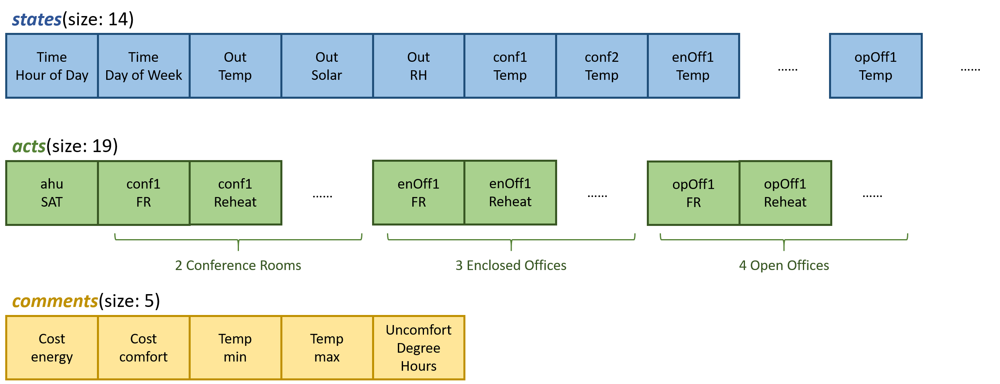

# AlphaBuilding-MedOffice
This is the official repository of AlphaBuilding MedOffice: a realistic OpenAI Gym environment that can be used to train, test and benchmark controllers for medium size office (1AHU + 9VAV boxes)

<!--
> *Zhe Wang, Bingqing Chen, Han Li, Tianzhen Hong. 2021. AlphaBuilding ResCommunity: A Multi-agent ReinforcementLearning Environment for Load Coordination. Submitted to Applied Energy*


[[slides]](docs/slides.pdf)[[paper]](https://dl.acm.org/doi/10.1145/3408308.3427980)
-->

# Overview
We developed AlphaBuilding MedOffice, a virtual testbed of medium size office that is wrapped up with OpenAI Gym. The building model is developed from [[EnergyPlus model of medium size office of DOE Commercial Reference Building type]](https://www.energy.gov/eere/buildings/commercial-reference-buildings). We are controlling the second floor of this building, which has 1 ATU serving 9 VAV boxes (2 for conference rooms, 3 for closed offices, 4 for open offices).

In addition to the virtual environment, we also implement and open source several RL algorithms (Deep Deterministic Policy Gradient (DDPG)), which could be used as benchmarks for algorithm comparison. 


# Code Usage
### Clone repository
```
git clone https://github.com/WalterZWang/AlphaBuilding-MedOffice.git
cd AlphaBuilding-MedOffice
```

### Test the environment
1. Pull the docker image: ``$ docker pull walterzwang/drl_eplus:9.2``
2. ``$ cd AlphaBuilding/docker/drl``, revise parameter VOLUMN_PATH in the makefile, then ``$ make run``
3. Run scripts:
    * test fmu: ``$ cd gym_AlphaBuilding``, run``python fmuModel/test_fmu.py``
    * test gym: ``$ cd gym_AlphaBuilding``, run``python test_gym.py``
4. Run DRL algorithms:
    * All scripts must be run from the root repository


### Repository structure
``analysis``: code to analyze the result

``docker``: scripts to develop the docker image

``docs``: Manuscript submitted version, figs in the paper, and documentation of this environment

``gym_AlphaBuilding``: scripts to develop the virtual simulation environment

``lib``: DRL models and utility functions

``log``: log files for TensorBoard visualization

``RL``: scripts for DRL


### Running
<!--
You can replicate our experiments, generate figures and tables used in the manuscript using the Jupyter notebooks saved in ``bin``: `section3.1 EDA.ipynb`, `section3.2 linear model.ipynb`, `section3.3 time-series model.ipynb`, `section3.4 tabular data model.ipynb`, `section4.1 model comparison.ipynb`, `section4.2 heat wave.ipynb`, `section4.3 convid.ipynb`
-->

# Interface
The co-simulation workflow between the environment and the controller is:


### Environment initialization
The first step is to initiate the environment. A list of input parameters to set up the environment is shown as follows:

| Input Parameter      | Description                                                            | Data Type| Default Value |
|----------------------|------------------------------------------------------------------------|----------|---------------|
| building_path        | Path to the FMU model                                                  | str      |               |
| sim_days             | Number of days for simulation, start from Jan. 01                      | int      |               |
| step_size            | Size of each time step for control and simulation, unit [s]            | int      |               |
| sim_year             | Year for simulation, used to create time index                         | int      |2015           |
| tz_name              | Thermal Time Constant, mean and std                                    | tuple    |'America/Los_Angeles' |
| eprice_path          | Path to the utility price signal, not used for energy conservation     | str      |None              |

### States, actions, and info/comments
Then at each time step, the environment consumes ``acts`` (determined by the controller), runs a single time step simulation, and returns ``states`` and ``comments``. The contents of ``acts``, ``states``, and ``comments`` are shown as follows:



***HourOfDay***: *in the range of 0 to 23*

***DayOfWeek***: *in the range of 0 to 6, 0 is Monday, 6 is Sunday*

### Methods
A list of methods provided by the environment is as follows:

| Methods                  | Example                                 | Input          | Returns                                       |
|--------------------------|-----------------------------------------|----------------|-----------------------------------------------|
| Initiate the env         | ``env=AlphaResEnv(*args)``              | Env parameters | An environment instance                       |
| Reset the env            | ``obs=env.reset()``                     | \              | Observations (Initial conditions)             |
| One step simulation      | ``obs,r,d,c=env.step(a_scaled)``        | Control actions| New observations, reward, done flag, comments |
| Scale states to [-1,1]   | ``s_scaled = env.scale_state(s_raw)``   | Raw states     | Scaled states                                 |
| Scale actions to [-1,1]  | ``a_scaled = env.scale_action(a_raw)``  | Raw actions    | Scaled actions                                |
| Rescale states to raw    | ``s_raw = env.rescale_state(s_scaled)`` | Scaled states  | Raw states                                    |
| Rescale actions to raw   | ``a_raw = env.rescale_action(a_scaled)``| Scaled actions | Raw actions                                   |

***The input of the step function needs to be scaled to [-1, 1].*** Users can use the env.rescale method to get the actual value

# Application
``AlphaBuilding MedOffice`` can be used to train controllers for commercial buildings. As an example, we demonstrate four applications here:

<!--
### Kalman Filter
Kalman Filter is a technique to integrate the physical model and inaccurate measurements for more accurate state estimation. We implement a Kalman Filter using Python Library ``pykalman`` in ``bin\Section4.1 Kalman_filter.ipynb`` and here is the result:


-->

# Feedback

Feel free to send any questions/feedback to: [Zhe Wang](mailto:zwang5@lbl.gov ) or [Tianzhen Hong](mailto:thong@lbl.gov)

# Citation

If you use our code, please cite us as follows:

<!--
```
@inproceedings{Chen2020COHORT,
author = {Chen, Bingqing and Francis, Jonathan and Pritoni, Marco and Kar, Soummya and Berg\'{e}s, Mario},
title = {COHORT: Coordination of Heterogeneous Thermostatically Controlled Loads for Demand Flexibility},
year = {2020},
isbn = {9781450380614},
publisher = {Association for Computing Machinery},
address = {New York, NY, USA},
url = {https://doi.org/10.1145/3408308.3427980},
doi = {10.1145/3408308.3427980},
booktitle = {Proceedings of the 7th ACM International Conference on Systems for Energy-Efficient Buildings, Cities, and Transportation},
pages = {31–40},
numpages = {10},
keywords = {demand response, smart thermostats, TCLs, distributed control},
location = {Virtual Event, Japan},
series = {BuildSys '20}
}
```
-->
